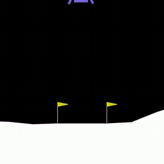

# Lunar Lander DRL

A Deep Q-Network with Prioritized Experience Replay (PER) that learns to land the
[Gymnasium `LunarLander-v3`](https://gymnasium.farama.org/environments/box2d/lunar_lander/)
craft, plus a small tool that replays a trained policy into an MP4.

<p align="center">
  
</p>

<p align="center">
  <sub>Two consecutive rollouts of the trained policy, scoring 296.9 and 307.3.</sub>
</p>

The environment gives an 8-dimensional observation (position, velocity, angle, angular
velocity, two leg-contact flags) and takes one of 4 discrete actions (do nothing, fire
left / main / right engine). An episode scoring an average of 200 over 100 runs is
considered solved.

## What is implemented

| Piece | Where | Notes |
| --- | --- | --- |
| Q-network | `rl/model.py` | MLP `8 → 256 → 128 → 64 → 4`, ReLU, Xavier initialised |
| Epsilon-greedy policy | `rl/agent.py` | epsilon annealed per episode |
| Transition storage | `rl/replaybuffer.py` | `ReplayBuffer`, ring buffer of flat numpy columns |
| Prioritized replay | `rl/replaybuffer.py` | `PEReplayBuffer`, proportional PER with importance sampling |
| Sum tree | `rl/sumtree.py` | `O(log n)` priority update and sampling |
| Schedules | `rl/utils.py` | log-spaced epsilon decay and beta anneal |
| Greedy evaluation | `rl/dqnper.py` | `evaluate`, fixed-seed greedy rollouts on a separate env |
| Best-model saving | `rl/checkpoint.py` | writes `ckpt/<timestamp>.pth` on a new best *greedy* score |
| Double DQN + Huber | `rl/dqnper.py` | online net selects, target net prices; smooth L1 loss; grad-norm clip |
| n-step returns | `rl/dqnper.py` | `_fold`/`remember`/`flush`, rewards folded over `--n_step` before bootstrapping |
| Training loop | `rl/dqnper.py` | `DQNPER`, the agent `main.py` runs |
| Trained weights | `models/lunarlander-v3.pth` | 175 KB, the policy in the GIF; see [Measured result](#measured-result) |

### How PER works here

Each transition is stored with a priority `p = (|TD error| + eps) ** alpha`. A sum tree
holds the priorities so a batch can be drawn in `O(batch * log capacity)`, stratified
over `batch_size` equal-mass segments of the total priority. A fresh transition has no
TD error yet, so it enters at the highest priority seen so far and is guaranteed one
replay before being re-priced.

Sampling by priority biases the gradient, which is corrected by importance sampling
weights `w = (N * P(i)) ** -beta`, normalised by the batch maximum. `beta` is annealed
from `replay_buffer_beta_begin` to `replay_buffer_beta_final`, so the correction is
full-strength late in training when the network is close to converged.

The target network is Polyak averaged (`target <- (1 - tau) * target + tau * online`)
every `target_update_freq` **steps**.

### Why Double DQN and Huber, specifically

Vanilla DQN takes `max` over the target network's own estimates, so its noise is
systematically read as value. Bootstrapping compounds that bias, and the policy
diverges after it looks like it is working. Double DQN splits the decision: the online
net picks the next action, the target net prices it.

The loss is Huber rather than squared error because it has to coexist with PER.
Prioritized sampling deliberately over-selects large TD errors, and squaring them lets a
single outlier dominate the batch gradient. Gradients are additionally clipped to
`--grad_clip`.

Measured on this environment, without the three: best 100-episode average 120.5 at
episode 819, then collapse to -90 by episode 1100 and no recovery. With them: 239.8,
held to the end of the run.

Treat that as a before/after, not a controlled ablation — `learning_rate` dropped from
`1e-3` to `5e-4` and `warm_start` rose from 2000 to 5000 in the same step. The collapse
shape (steady climb, then divergence once exploration stops) is the documented signature
of Q-value overestimation, which is what Double DQN addresses, but the three were not
isolated one at a time.

## Install

The project is managed with [uv](https://docs.astral.sh/uv/). It reads `pyproject.toml`,
pins the exact resolution in `uv.lock` and the interpreter in `.python-version`:

```bash
uv sync
```

That is the whole setup — uv fetches Python 3.13 if needed, builds `.venv`, and installs
Box2D along with everything else. Nothing needs activating; `uv run <cmd>` uses the
environment directly.

To refresh every dependency to its newest compatible release:

```bash
uv lock --upgrade && uv sync
```

On Linux the default PyPI `torch` wheel already ships CUDA, so no separate GPU install
is needed. On Apple silicon the same wheel carries MPS.

## Train

```bash
uv run main.py
```

Every hyperparameter is a flag; `uv run main.py --help` prints them with defaults.

```bash
uv run main.py --n_episodes 2000 --eps_ratio 0.5 --learning_rate 5e-4
```

| Flag | Default | Meaning |
| --- | --- | --- |
| `-en, --env_name` | `LunarLander-v3` | Gymnasium environment |
| `-ne, --n_episodes` | `100000` | Episodes to train |
| `-eb, --eps_begin` | `1.0` | Starting exploration rate |
| `-ef, --eps_final` | `0.1` | Final exploration rate |
| `-er, --eps_ratio` | `0.9` | Fraction of episodes spent annealing epsilon |
| `-g, --gamma` | `0.99` | Reward discount |
| `-lr, --learning_rate` | `1e-3` | Adam learning rate |
| `-bs, --batch_size` | `64` | Transitions per gradient step |
| `-rbs, --replay_buffer_size` | `100000` | Replay capacity |
| `-rba, --replay_buffer_alpha` | `0.6` | 0 = uniform sampling, 1 = fully prioritized |
| `-rbbb, --replay_buffer_beta_begin` | `0.4` | Importance sampling correction, start |
| `-rbbf, --replay_buffer_beta_final` | `1.0` | Importance sampling correction, end |
| `-rbbr, --replay_buffer_beta_ratio` | `0.1` | Fraction of episodes spent annealing beta |
| `-rbe, --replay_buffer_eps` | `0.001` | Priority floor, keeps zero-error transitions sampleable |
| `-tuf, --target_update_freq` | `1` | Steps between target soft updates |
| `-tut, --target_update_tau` | `1e-3` | Soft update rate |
| `-gc, --grad_clip` | `10.0` | Max gradient norm per optimizer step |
| `-ns, --n_step` | `3` | Steps of reward folded into one transition |
| `-ws, --warm_start` | `1000` | Random transitions loaded before learning starts |
| `-arl, --avg_reward_len` | `100` | Window for the running average score |
| `-evf, --eval_freq` | `25` | Episodes between greedy evaluations |
| `-eve, --eval_episodes` | `20` | Greedy episodes per evaluation; checkpoints select on their mean |
| `-ss, --solved_score` | `275.0` | Stop training once the greedy mean reaches this |
| `-s, --seed` | `42` | Seed for numpy, torch, the environment and its action space |
| `--logs_dir` | `./logs` | TensorBoard output |
| `--ckpt_dir` | `./ckpt` | Checkpoint output |

Watch it learn:

```bash
uv run tensorboard --logdir logs
```

Scalars: `score/val` (episode reward), `score/avg` (running average over
`avg_reward_len`), `score/eval` (greedy evaluation), `episode/eps`, `episode/beta`,
`episode/steps`.

### Checkpoints are selected on greedy play, not on the training average

Every `--eval_freq` episodes the agent plays `--eval_episodes` fully greedy episodes on a
fixed set of seeds, in a separate environment so evaluation never perturbs the training
environment's RNG stream. That mean is the number `Checkpoint` compares, and training
stops once it reaches `--solved_score`.

This matters more than it sounds. Training episodes are epsilon-greedy, so their running
average measures exploration noise as much as policy quality, in *either* direction:

- Selecting on the training average once saved a checkpoint reporting 239.8 that scored
  **160.6** in greedy play — a lucky streak of exploration.
- The run that produced the current checkpoint recorded a training average of 78.2 at the
  moment greedy play scored **269.1**. The old criterion would have discarded a solved
  policy.

Weights land in `ckpt/<YYYY_MM_DD_HH_MM>.pth`, rewritten on each new best. Nothing is
written until a greedy evaluation scores above zero, so an untrained run leaves no file.

### Measured result

```bash
uv run main.py --n_episodes 4000 --eps_ratio 0.35 --eps_final 0.01 \
               --learning_rate 5e-4 --warm_start 5000 --n_step 3 \
               --eval_episodes 20 --solved_score 275
```

Stops early at **episode 474** on a greedy score of 283.7, roughly 10 minutes on an
M-series CPU. Evaluated on 30 held-out seeds (1000-1029, disjoint from the seeds used for
selection, so the number is not the one that was optimised), against the same run
*without* n-step returns:

| Metric | 1-step | 3-step |
| --- | --- | --- |
| Mean | 220.3 | **280.6** |
| Median | 245.4 | **281.2** |
| Solved (>= 200) | 25 / 30 | **30 / 30** |
| Crashed (< 0) | 2 / 30 | **0 / 30** |
| Worst | -121.7 | **249.8** |

The worst 3-step episode scores higher than the *median* 1-step episode. See
[why n-step killed the hovering](#why-n-step-killed-the-hovering).

Single seed, single run. High-variance algorithm — treat these as one sample, not a
benchmark, and use 3-5 seeds if you need a defensible number.

### Why n-step killed the hovering

The 1-step agent's failure mode was hovering: descending to just above the pad and
holding there until the 1000-step limit. That is not random flailing, it is rational
given slow credit assignment. `LunarLander` pays `+100` once, at touchdown, but pays
continuous shaping reward for sitting near the pad at low velocity. Hovering banks the
shaping reward now; landing's bonus sits ~300 steps away and, with one-step
bootstrapping, creeps backwards through the value function one state per update. For a
long stretch of training, hovering genuinely *is* the better-valued action, and some
states never escape that local optimum.

Folding three rewards into each stored transition moves the landing bonus back three
times faster per update. Two details make it correct rather than merely faster:

- The bootstrap discount becomes `gamma ** k`, not `gamma`, so the buffer carries a
  per-transition `discounts` column. Reusing `gamma` there would quietly mis-scale every
  target.
- The window is flushed at each episode boundary, and the fold stops at a terminal inside
  the window. Without the flush the last `n_step - 1` transitions of every episode — the
  ones containing the actual touchdown — would be dropped, which is exactly the data that
  teaches landing.

## Known limitations and what to do next

Ranked by value for effort. Nothing here is required for the agent to work; each is a
known gap rather than a bug.

1. **Replay ratio is 1.0** (`learn` runs on every environment step). One gradient step
   per transition is roughly 4x the usual for this environment. A `--train_freq 4` would
   cut wall clock and typically steadies training.
2. **ε is scheduled per episode, not per step.** Episode length ranges from ~90 steps to
   the 1000-step limit, so equal episode counts mean very unequal experience. Index the
   schedule by `self.steps`.
3. **`replay_buffer_beta_ratio` defaults to `0.1`**, so β reaches 1.0 after a tenth of
   training. The PER paper anneals β across the whole run.
4. **Dueling head** (`rl/model.py`) — separate value and advantage streams. Consistently
   helps here, but changes `state_dict` keys and so invalidates existing `.pth` files.
5. **`max_priority` never decays** (`rl/replaybuffer.py`). One large TD error inflates
   the entry priority of every later transition for the rest of the run.

Not worth it on this problem: MPS on Apple silicon. The network is small enough that
per-step kernel launch overhead would likely beat the compute saving.

## Render

A trained checkpoint ships with the repo at `models/lunarlander-v3.pth`, and is the
default, so this works straight after `uv sync`:

```bash
uv run render.py                                  # 5 rollouts -> LunarLander.mp4
uv run render.py --num-sims 6 --seed 1000         # the rollouts shown in the GIF above
uv run render.py --no-save                        # scores only, no video
uv run render.py --pth_path ckpt/<your>.pth       # a checkpoint you trained
```

Frames are centre-cropped to a square and streamed straight into `LunarLander.mp4`, so
memory stays flat regardless of `--num-sims`. Per-simulation rewards are echoed to the
terminal. `uv run render.py --help` lists the flags.

Checkpoints, TensorBoard logs and the MP4 are all gitignored — they are outputs, not
sources. The README GIF is the one committed artefact, regenerated with:

```bash
uv run render.py --pth_path ckpt/<best>.pth --mp4_path clip.mp4 --num-sims 2 --seed 1000
ffmpeg -i clip.mp4 -vf "fps=20,scale=320:-1:flags=lanczos,crop=320:320,palettegen=max_colors=32" pal.png
ffmpeg -i clip.mp4 -i pal.png \
  -lavfi "fps=20,scale=320:-1:flags=lanczos,crop=320:320 [x]; [x][1:v] paletteuse=dither=bayer" \
  docs/lunarlander.gif
```

The scene is nearly monochrome, so a 32-colour palette keeps it under 250 KB.

## Tests

```bash
uv run pytest test_rl.py     # or: uv run test_rl.py
```

Covers the sum tree, both replay buffers, the schedules, and a three-episode training
run that exercises the real environment end to end.

Type checking is clean under pyright:

```bash
uv run --with pyright pyright .
```

## Layout

```
pyproject.toml       dependencies and uv configuration
uv.lock              exact resolved versions, committed
.python-version      interpreter uv provisions (3.13)
main.py              training entry point (argparse)
render.py            policy rollout to MP4 (click)
test_rl.py           self-checks, plus a short end-to-end training run
rl/agent.py          epsilon-greedy policy
rl/checkpoint.py     best-score model saving
rl/dqnper.py         the training loop
rl/model.py          Q-network
rl/replaybuffer.py   ring buffer storage + prioritized replay
rl/sumtree.py        priority sum tree
rl/utils.py          epsilon / beta schedules, env space validation
```

## References

- [Gymnasium documentation](https://gymnasium.farama.org/)
- [Human-level control through deep reinforcement learning](https://www.nature.com/articles/nature14236) — DQN
- [Prioritized Experience Replay](https://arxiv.org/abs/1511.05952) — Schaul et al.
- [Papers with Code: Prioritized Experience Replay](https://www.paperswithcode.com/method/prioritized-experience-replay)
- [David Silver's Introduction to Reinforcement Learning](https://deepmind.com/learning-resources/-introduction-reinforcement-learning-david-silver)
- [higgsfield/RL-Adventure](https://github.com/higgsfield/RL-Adventure)
- [facebookresearch/ReAgent](https://github.com/facebookresearch/ReAgent)
